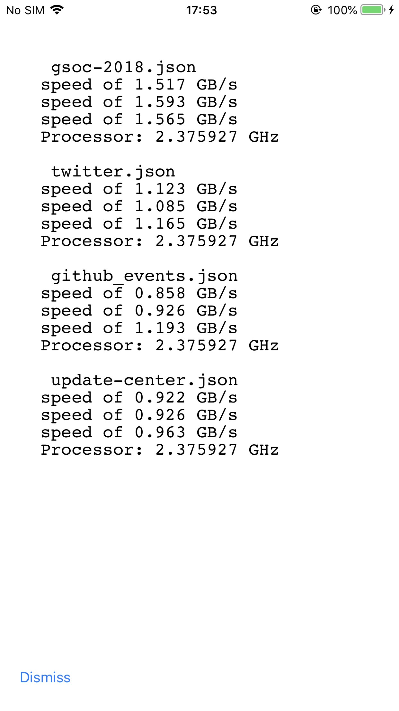

# simdjson-cocoa

[](https://travis-ci.org/ppamorim/simdjson-cocoa)
[](https://cocoapods.org/pods/simdjson-cocoa)
[](https://cocoapods.org/pods/simdjson-cocoa)
[](https://cocoapods.org/pods/simdjson-cocoa)



## Example

To run the example project, clone the repo, and run `pod install` from the Example directory first.

## Requirements

## Installation

simdjson-cocoa is available through [CocoaPods](https://cocoapods.org). To install
it, simply add the following line to your Podfile:

```ruby
pod 'simdjson-cocoa'
```

## Based on

Thank you Lemire for sharing your project, with it I was able to build this wrapper.

https://github.com/lemire/iossimdjson

## Author

ppamorim, pp.amorim@hotmail.com

## License

simdjson-cocoa is available under the MIT license. See the LICENSE file for more info.
